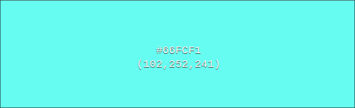
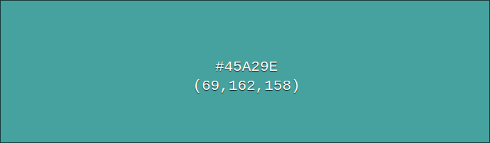

# project-3

## Grote verbeterpunten

- de manier waarop de login staus wordt opgeslagen in de session is niet veilig
- de UI/UX voor niet 1920x1080 display's

dit is het 3e project van het eerste schooljaar op het [tcr](https://www.techniekcollegerotterdam.nl/)

## Team: chans

het team bestond uit: mij (Sander), Chaymae en Nathan

[Trello](https://trello.com/b/wGUGhuH0/scrum-board) niet publiek zichtbaar 

### CheatSheat

[quickref.me](https://quickref.me/javascript)

[convert between color formats](https://www.w3schools.com/colors/colors_converter.asp)

## color palet

|name|val hex|val rgb|img|
|:--:|:-----:|:-----:|:-:|
|Dark grey|#0b0c10|rgb(11, 12, 16)||
|Dark grey2|#1f2833|rgb(31, 40, 51)||
|Ligt grey|#c5c6c7|rgb(197, 198, 199)||
|Light Groen|#66fcf1|rgb(102, 252, 241)||
|Donker groen|#45a29e|rgb(69, 162, 158)||

