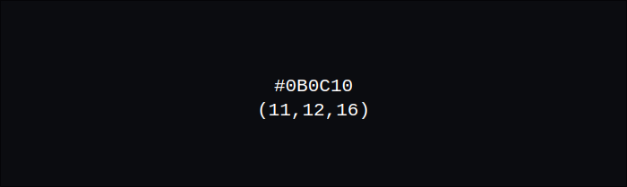
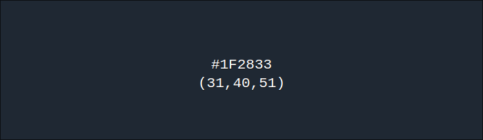
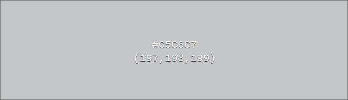

# project-3

dit is het 3e project van het eerste schooljaar op tcr

## Team: chans

niet publiek zichtbaar

[Trello](https://trello.com/b/wGUGhuH0/scrum-board)

### CheatSheat

[quickref.me](https://quickref.me/javascript)

[convert between color formats](https://www.w3schools.com/colors/colors_converter.asp)

[sitemap](https://imgs.search.brave.com/UvsebMHoTFN0Vce2h9YyhmcZotkAZCZiryL3NuSvaRs/rs:fit:860:0:0/g:ce/aHR0cHM6Ly93d3cu/cXVpY2tzcHJvdXQu/Y29tL3dwLWNvbnRl/bnQvdXBsb2Fkcy8y/MDE5LzAxL3dlYnNp/dGUtc2l0ZW1hcC10/ZW1wbGF0ZS5wbmc)

## color palet

|name|val hex|val rgb|img|
|:--:|:-----:|:-----:|:-:|
|Dark grey|#0b0c10|rgb(11, 12, 16)||
|Dark grey2|#1f2833|rgb(31, 40, 51)||
|Ligt grey|#c5c6c7|rgb(197, 198, 199)||
|Light Groen|#66fcf1|rgb(102, 252, 241)||
|Donker groen|#45a29e|rgb(69, 162, 158)||
